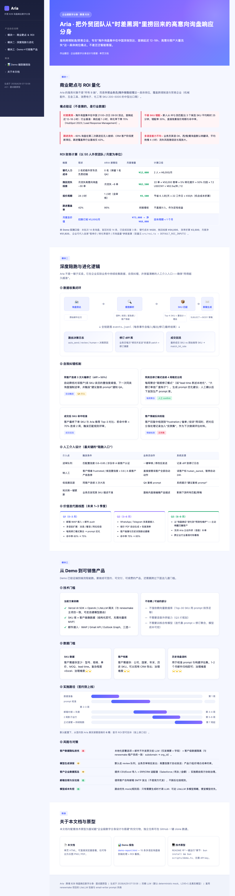
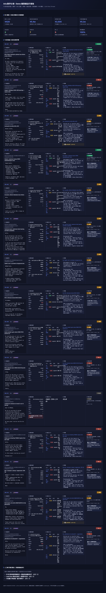
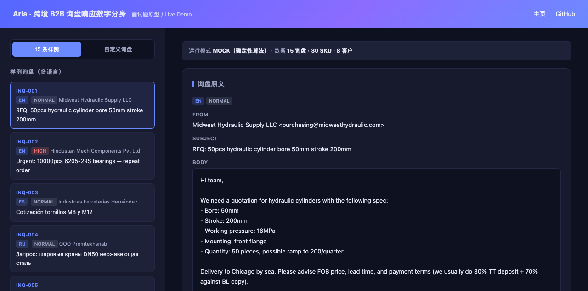
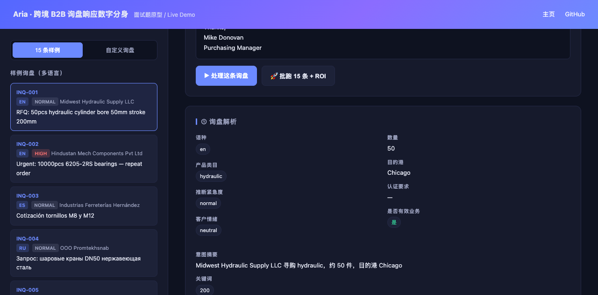

# Aria · 跨境 B2B 询盘响应数字分身

> 企业级数字分身设计与搭建 — 可运行原型。
> 服务跨境制造/贸易企业的**外贸业务员/海外销售经理**岗位，专攻"海外询盘集中在中国深夜到达、首响延迟 12-18h、高意向客户大量流失"这一具体痛点。

🌐 **在线浏览**：
- 着陆页 / 产品动态说明：https://diesel-chen.github.io/aria-digital-twin/
- Demo 端到端运行报告：https://diesel-chen.github.io/aria-digital-twin/demo-report.html
- 互动 Web Demo（需本地启动，见下方"启动交互式 Web Demo"）

| 产品动态说明（pitch.html） | Demo 端到端运行报告（demo-report.html） |
| --- | --- |
|  |  |

## 它能为企业算回多少账？

以 50 人外贸团队为例（详细计算见 `docs/pitch.html`）：

| 维度 | 现状 | Aria 接管后 | 月度增量 |
| --- | --- | --- | --- |
| 替代人力成本 | 2 名初级外贸专员负责初响 | 0 名（保留 1 名 QA） | **¥12,000** |
| 挽回流失线索 | 月流失高意向询盘 ~30 单 | 月流失 ~8 单 | **¥62,500** |
| 报价周期 | 24 h | 1 h（含审核） | **¥3,500** |
| 跟进覆盖率 | 42% | 95% | 间接增收 |

**月度净增量 ≈ ¥68,000**（已扣除 ¥5,000/月订阅费）。回本周期 < 1 个月。

## 一键跑通（不需要 API key）

```bash
# 安装 bun (如未装): brew install oven-sh/bun/bun
bun install

# 跑端到端 demo（默认 mock 模式，使用确定性算法替代 LLM）
bun scripts/demo.ts

# 生成产品动态说明文档
bun scripts/generate-pitch.ts

# 一键全跑
bun run all

# 打开两份 HTML 看结果
open docs/demo-report.html    # 15 条询盘 5 段式处理详情 + ROI 看板
open docs/pitch.html          # 产品动态说明（单页 HTML，可截长图）
```

## 启动交互式 Web Demo

```bash
# 默认 3000 端口，mock 模式
bun server.ts
# 浏览器打开 http://localhost:3000
```

页面提供：左侧 15 条样例询盘 + 自定义输入；右侧实时展示「解析 / SKU 匹配 / 多语言草稿 / 路由决策」四步结果；一键「批跑 15 条 + ROI」看板。

| Web Demo 首页 | 处理结果 |
| --- | --- |
|  |  |

## Docker 部署

```bash
# 一键起服务（mock 模式，不需要 API key）
docker compose up -d
# 浏览器打开 http://localhost:3000

# 单独构建 / 运行
docker build -t aria-digital-twin .
docker run -d -p 3000:3000 --name aria aria-digital-twin
```

镜像基于 `oven/bun:1.3-alpine`，约 200MB；启动后即可访问页面与 `/api/*` 接口。要走真实 LLM，把 `docker-compose.yml` 里的 `LIVE=1` 与 `OPENAI_API_KEY` / `LITELLM_*` 取消注释填入即可。

## 走真实 LLM（可选）

`.env` 已被 `.gitignore` 忽略，凭据只在本地存在，不会推到 GitHub。

```bash
cp .env.example .env

# 选项 A: 直接走 OpenAI
echo "OPENAI_API_KEY=sk-..." >> .env
echo "ARIA_MODEL=gpt-4o-mini" >> .env

# 选项 B: 走 LiteLLM 网关（推荐，多模型可选）
echo "LITELLM_BASE_URL=https://your-litellm.example.com/v1" >> .env
echo "LITELLM_API_KEY=sk-..." >> .env
echo "ARIA_MODEL=gpt-5.4" >> .env   # 或网关支持的任意 chat 模型

# 端到端跑 15 条询盘
LIVE=1 bun scripts/demo.ts

# 起 Web Demo，UI 上每次「处理这条询盘」都会真实调用 LLM
LIVE=1 bun server.ts
```

LIVE 模式下 `event.llmVia` 会是 `["live", "live", "live"]`，对应「解析 / 匹配 / 草稿」三步均走真实 LLM。

## 目录结构

```
aria-digital-twin/
├── data/                   # Mock 数据（自理）
│   ├── inquiries.json      # 15 条多语言询盘（英/西/俄）
│   ├── products.json       # 30 条机械配件 SKU
│   └── customers.json      # 8 条客户档案
├── src/
│   ├── llm.ts              # 双模 LLM wrapper（默认 mock，LIVE=1 走真实）
│   ├── prompts/            # 三个核心 prompt 模块
│   │   ├── parse-inquiry.ts    # 询盘 → 结构化字段
│   │   ├── match-products.ts   # 30 SKU 中排出 Top 3 + 置信分
│   │   └── draft-reply.ts      # 多语言回复草稿
│   ├── flow/
│   │   ├── pipeline.ts     # parse → match → draft → 路由决策
│   │   ├── follow-up.ts    # 72h 沉默触发跟进
│   │   └── revision-log.ts # 业务员修订 diff 聚合
│   ├── roi.ts              # 替代成本 / 挽回线索 / 效率提升
│   └── report/             # HTML 渲染
├── scripts/
│   ├── demo.ts             # 端到端跑通脚本
│   └── generate-pitch.ts   # 生成产品动态说明
└── docs/                   # 运行后输出
    ├── demo-report.html
    └── pitch.html
```

## 三大评估维度对照

### 1. 明确的商业靶点（不是泛泛智能客服）
- **行业**：跨境 B2B 制造与贸易（机械配件、五金工具、消费电子、化工等 SKU 200~5000 的中型出口商）
- **岗位**：外贸业务员 / 海外销售经理 / 询盘专员
- **场景边界**：只接管"询盘首响 → SKU 匹配 → 草稿生成 → 跟进编排"，不做客户陪聊、不做合同/法务、不做 C 端客服

### 2. ROI 可量化
- 替代成本、挽回线索、效率提升三项独立计算，公式见 `src/roi.ts`
- 企业可代入自家"客单价 / 转化率提升 / 月询盘量 / 订阅价"参数复算
- Demo 实测口径在 demo-report.html 顶部 ROI 看板

### 3. 深度陪跑逻辑
- **数据收集闭环**：每条询盘事件全字段落 `events.jsonl`（输入/输出/路由/修订/最终结果）
- **自我纠错**：
  - 同客户连续 3 次大幅修订（diff > 50%）→ 自动降低置信度
  - 同类目修订模式连续 4 周稳定出现 → 生成 prompt 优化建议（人工 confirm 后下发）
  - 客户最终下单 SKU vs 推荐 SKU → match_hit_rate
- **人工介入**：
  - 送审队列（中等置信度）
  - 直接转人工（情绪/认证/低置信）
  - 一键接管（标记 `human_owned` 暂停自动 24h）

### 4. Mock 数据自理
- 15 条贴近真实风格的多语言询盘（英/西/俄），覆盖轴承/阀门/紧固件/液压件四大类
- 询盘 receivedAt 故意分布在中国 21:00–09:00 时差盲区，验证"挽回流失线索"的归因逻辑
- 含一条非业务投资邀约（INQ-011），验证过滤能力
- 含一条业务员催单跟进（INQ-012）、客户抱怨未回复（INQ-015），验证情绪检测与转人工

## 与 renewmake 主项目的关系

本仓库是从 renewmake 项目（B2B SaaS）抽取出的独立 demo，复用以下设计：

| 来源 | 复用方式 |
| --- | --- |
| `src/lib/ai/litellm.ts` | LLM provider 包装思路（双 baseURL 支持 OpenAI / LiteLLM 网关） |
| `src/app/api/email-writer/route.ts` | B2B 邮件 prompt 结构（场景感知 + 语气 + 格式约束） |
| `src/ai/utils/fake-data.ts` | Faker 风格 mock 数据生成思路 |
| `src/db/crm-schema.ts` | 客户/产品字段命名约定 |

不依赖：renewmake 的数据库 / 租户系统 / 配额系统 — 全部 mock 化以保证 3 小时可独立跑通。

## 范围外（Out of Scope）

- 不做语音外呼分身（Q3 才规划）
- 不做面向 C 端消费者的客服分身
- 不做合同/法务文本生成（涉及合规边界）
- 不接真实邮箱 IMAP（产品化阶段补）

## License

MIT
